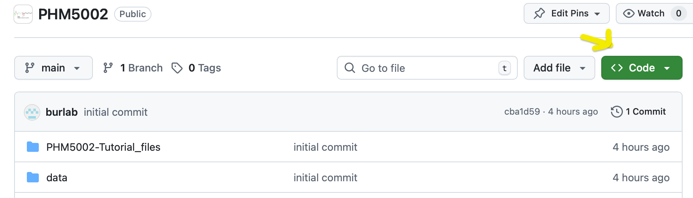

# PHM5002 - Metabolomics Data Preprocessing

*From Raw Data to Reliable Analytical Results*

### Summary

R-based tutorial for processing targeted plasma lipidomics data using the dataset by [Tan et al. (2022)](https://doi.org/10.1161/ATVBAHA.121.316847), in which 413 plasma lipids were quantified in 440 samples by LC–MS/MS with multiple reaction monitoring (MRM). Starting from preprocessed peak-area data, the tutorial demonstrates typical postprocessing and key quality control steps.

### Preparing for the tutorial

Please ensure to have R, RStudio and required R packages installed **before the start of the tutorial**:

-   R (version 4.4, or higher). Download from <https://cloud.r-project.org/>. Check your R version by running following command in your console: `R.Version()$version.string`

-   RStudio (Version \>= 2024.04). Download from <https://posit.co/download/rstudio-desktop/>. Check your `RStudio` version by clicking *About RStudio* under the menu *Help.*

-   To run the code, following R packages must be installed **before** the start of the tutorial: `tidyverse` and `here`. To convert the notebook to HTML or DOCX, also the packages `knitr` and `rmarkdown` are required. Install all these packages via `install.packages(c("tidyverse", "here", "broom", "knitr", "rmarkdown"))`

### Download the project

Download the R Project containing the scripts and data used in this workshop from this repository (click on the green button "**\<\>Code"** and then "**Download ZIP**"). Alternatively, you can clone this repository using Git, RStudio and Positron.

{fig-align="center" width="645"}

### Questions or Issues?

Do not hesitate to contact us!

### Authors

-   Bo Burla - [Singapore Lipidomics Incubator](https://sling.sg) \@ NUS

### License

This project is licensed under the MIT License - see the [LICENSE.md](LICENSE.md) file for details
